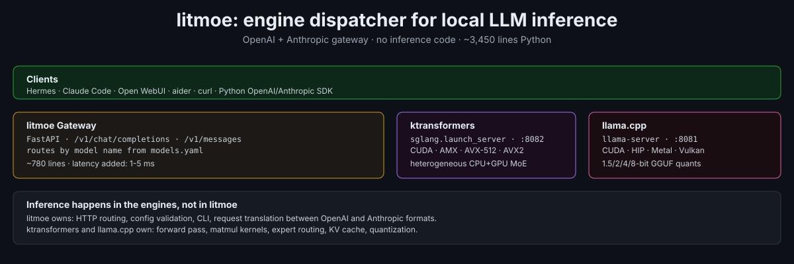

# litmoe

**lit + MoE** — a light gateway for Mixture-of-Experts models.

OpenAI- and Anthropic-compatible gateway for [llama.cpp](https://github.com/ggml-org/llama.cpp) and [ktransformers](https://github.com/kvcache-ai/ktransformers). One `models.yaml`, one port, every model reachable by name — from a 4B-active MoE that chats interactively on a 48 GB laptop to trillion-parameter models on a server.

litmoe is not an inference engine — the forward pass runs in llama.cpp or ktransformers. What litmoe adds:

- **One API for multiple engines.** Mix llama.cpp and ktransformers in the same `models.yaml`. Clients see one flat model list at one endpoint.
- **Anthropic Messages API.** `/v1/messages` (and `/v1/messages/count_tokens`) are translated to OpenAI chat completions, so Claude Code, Hermes Agent, and other Anthropic-format tools work unchanged. Model aliases (`claude-sonnet-4-5` → your local model) are built in, and `scripts/claude-local` / `scripts/hermes-local` run a harness against the gateway **without touching its normal configuration** — plain `claude` keeps using your Anthropic account.
- **A curated, RAM-tiered model catalog.** `litmoe models` shows what fits your machine; `litmoe install --model X` downloads exactly the right GGUF files (root or per-quant repo layouts, sharded or not, plus the vision projector for multimodal models) and writes the config entry.
- **Hardware-aware setup.** `litmoe doctor` reports physical cores, RAM, AVX-512/AMX, NVIDIA GPUs, and which engines are installed, then recommends an engine and models. Context size is set to the model's native window and reduced only when the KV cache would not fit in RAM.
- **Engine lifecycle.** Subprocess supervision with health checks, clean shutdown via process groups, per-model append-only logs, per-model CLI flag and environment passthrough. `litmoe stop` only touches engines litmoe started (PID files), never an Ollama/LM Studio/manual llama-server.
- **Streaming.** Raw SSE passthrough for OpenAI requests; event-by-event translation for Anthropic requests (text, thinking, tool_use).

---

## Which models, on what hardware

Speed on CPU/Metal is governed by *active* parameters per token, so the default tier is small-active MoEs: on the project's 24-core AVX2 box the 4B-active default runs at 9–12.7 t/s, the same band as a 9B dense model, while being a far stronger model (numbers and raw logs in [docs/measurements/](docs/measurements/README.md)). Every entry below was verified against the HuggingFace file listing and llama.cpp's architecture table on 2026-09-16; `litmoe models` prints the same table with a fits / does-not-fit column for your RAM.

| Tier | Model (`--model`) | Total / active | Default quant | Disk | Why |
|---|---|---|---|---|---|
| **48 GB laptop** | `gemma-4-26b-a4b` **(default)** | 26B / 4B | UD-Q4_K_XL | 17 GB | Fast, multimodal (vision), 256K ctx |
| | `qwen3.6-35b-a3b` | 35B / 3B | UD-Q4_K_XL | 22 GB | Fast, strong coder |
| | `nemotron-3.5-lightning-30b-a3b` | 30B / 3B | UD-Q4_K_XL | 26 GB | Hybrid Mamba-MoE, 1M ctx |
| | `gpt-oss-20b` | 21B / 3.6B | UD-Q4_K_XL | 12 GB | Native MXFP4 |
| | `kimi-linear-48b` | 48B / 3B | Q4_K_M | 30 GB | KDA linear attention, 1M ctx |
| | `gemma-4-12b`, `qwen3.8-9b-distill` | dense 12B / 9B | Q4_K_M | 7 / 6 GB | Small dense |
| | `qwen3.8-27b`, `gemma-4-31b` | dense 27B / 31B | UD-Q4_K_XL | 18 / 19 GB | Strongest small models; 7–9× the active params of the MoEs above, so expect a fraction of their speed |
| **96 GB laptop / desktop** | `gpt-oss-120b` | 117B / 5.1B | UD-Q4_K_XL | 63 GB | Native MXFP4, fast |
| | `qwen3.5-122b-a10b` | 122B / 10B | UD-IQ4_XS | 60 GB | |
| | `nemotron-3-super-120b-a12b` | 120B / 12B | UD-IQ4_XS | 64 GB | 1M ctx |
| | `llama-4-scout` | 109B / 17B | UD-Q4_K_XL | 62 GB | 10M ctx |
| **192 GB workstation** | `qwen3.8-flash-next` | 177B MoE | UD-Q4_K_XL | 111 GB | Sep 2026; needs a Sep-2026+ llama.cpp |
| | `minimax-m2.7` | 229B / 10B | UD-Q4_K_XL | 141 GB | |
| | `deepseek-v4-flash` | 284B MoE | UD-Q4_K_XL | 155 GB | 1M ctx |
| **512 GB server** | `minimax-m3`, `glm-5.3`, `deepseek-v3.2`, `kimi-k2.5`, `kimi-k2.6` | 426B–1.03T | Q2–Q4 | 247–345 GB | |
| **768 GB server** | `qwen3.8` (2.4T/95B), `kimi-k3` (2.78T/93B) | | UD-IQ1_S | 508 / 594 GB | 93–95B *active*: ~1 t/s on a 24-core CPU regardless of RAM |

ktransformers entries (Linux + NVIDIA GPU, native precision safetensors, no GGUF): `glm-5.3-flash` (FP8, 328 GB, 1M ctx, multimodal — supported by ktransformers since 2026-08-26 and *not* by released llama.cpp), `deepseek-v4-flash-kt` (MXFP4), `kimi-k2-thinking` (RAWINT4), `minimax-m3-kt` (MXFP8), `minimax-m2.7-kt` (FP8), `deepseek-v3.2-kt` (FP8).

`litmoe install --model X` picks the quant for your machine: the default above when it fits, otherwise the largest one that does (e.g. `qwen3.5-122b-a10b` with 48 GB of RAM becomes UD-IQ2_XXS, 37 GB). `--quant` overrides. On Apple Silicon, Metal can use ~75% of RAM by default; `litmoe models` and `litmoe install` both apply that budget.

---

## Engines

### llama.cpp (default)

**Repo:** https://github.com/ggml-org/llama.cpp

- CUDA, HIP (AMD), Metal (Apple), Vulkan, SYCL, OpenCL, CANN — and plain CPU
- 1–8-bit GGUF quantization; pre-quantized GGUFs from [Unsloth](https://huggingface.co/unsloth)
- Every model in the catalog above has its architecture in `src/llama-arch.cpp` (`gemma4`, `qwen35moe`, `qwen35`, `qwen4exp`, `nemotron_h_moe`, `gpt-oss`, `kimi-k3`, `kimi-linear`, `deepseek2`, `deepseek4`, `glm-dsa`, `minimax-m2`, `minimax-m3`, `llama4`); `qwen4exp` (Qwen3.8-Flash-Next) needs a build from September 2026 or later
- `--jinja` chat templates (tool calling) are on by default in current builds

**Install:** `litmoe install --engine llamacpp` — downloads the matching release binary (`--llamacpp-variant cpu|cuda|cuda13|vulkan|rocm`, auto-selects CUDA when an NVIDIA GPU is visible) or builds from source when glibc < 2.34.

### ktransformers

**Repo:** https://github.com/kvcache-ai/ktransformers · MADSys Lab @ Tsinghua + Approaching.AI · SOSP 2025

Since v0.4 the serving stack is **SGLang + kt-kernel** (`python -m sglang.launch_server --kt-method …`): attention and dense layers on the GPU, MoE experts on the CPU in their native precision.

- **Requirements:** Linux x86-64, NVIDIA GPU (SM 8.0+), Python 3.11/3.12. PyPI wheels need glibc ≥ 2.35; otherwise `litmoe install --engine ktransformers` runs the upstream source build.
- **CPU expert backends (`kt_method`):** FP8, FP8_PERCHANNEL, BF16, RAWINT4, MXFP4, MXFP8 need **AVX-512**; AMXINT4/AMXINT8 need Intel AMX; LLAMAFILE (GGUF weights) runs on AVX2.
- **Models:** registry entries (DeepSeek-V3.x/V4-Flash, Kimi-K2-Thinking, MiniMax-M2.x/M3) plus tutorial-launched models (GLM-5.3-Flash, Kimi-K2.5/K2.6, Qwen3-Next). 2026 additions upstream: GLM-5.3-Flash native FP8 (Aug 26), LoRA fine-tuning on AVX-512 CPUs incl. AMD (Aug 17), Kimi K2.5/K2.6 RAWINT4 fine-tuning (Sep 13), DeepSeek-V4-Flash on Ascend NPU (Aug 16) — fine-tuning and NPU paths are outside litmoe's scope.

---

## Quick start

```bash
git clone https://github.com/chazhyseni/litMoE
cd litMoE
pip install -e .            # use the SAME Python for install and serve

litmoe doctor               # hardware, engines, recommended models for your RAM
litmoe install              # installs llama.cpp and lists models that fit
litmoe install --model gemma-4-26b-a4b   # 17 GB; writes the entry into models.yaml
litmoe serve

curl http://127.0.0.1:8080/v1/models
```

Or skip the pre-download: `litmoe init` writes a `models.yaml` whose `model_path` entries are HuggingFace specs (`owner/repo:QUANT`); llama-server fetches them on first start.

> **macOS with several Pythons:** install and run litmoe with the same interpreter (`/path/to/python -m pip install -e .` / `/path/to/python -m litmoe serve`). Homebrew Python 3.14 has TCC file-access restrictions on `~/.litmoe/models`; conda/miniforge Python does not.

Full guide: [docs/SETUP.md](docs/SETUP.md)

---

## models.yaml

```yaml
host: 127.0.0.1
port: 8080
api_key: null            # or a string to require Bearer / x-api-key auth

models:
  # Laptop default: fast MoE with vision. HF spec -> llama-server downloads on first start.
  - id: gemma-4-26b-a4b
    engine: llamacpp
    model_path: unsloth/gemma-4-26B-A4B-it-GGUF:UD-Q4_K_XL
    n_gpu_layers: -1       # -1 = offload what fits (Metal/CUDA), 0 = CPU only
    n_ctx: 0               # 0 (or anything < 16384) = native context, reduced only if the KV cache won't fit RAM
    aliases:               # Anthropic model names Claude Code sends; haiku is used for its background calls
      - claude-sonnet-4-5
      - claude-opus-4-1
      - claude-haiku-4-5

  # Pre-downloaded GGUF (what `litmoe install --model` writes)
  - id: qwen3.6-35b-a3b
    engine: llamacpp
    model_path: /home/me/.litmoe/models/qwen3.6-35b-a3b/UD-Q4_K_XL/Qwen3.6-35B-A3B-UD-Q4_K_XL.gguf
    n_ctx: 262144
    extra_args: ["-t", "12"]   # any llama-server flags; -t overrides the physical-core default

  # ktransformers via sglang-kt (Linux + NVIDIA GPU)
  - id: glm-5.3-flash
    engine: ktransformers
    model_path: zai-org/GLM-5.3-Flash      # HF id or local safetensors directory
    kt_method: FP8                         # CPU expert backend; LLAMAFILE + gguf_path for GGUF experts
    kt_num_gpu_experts: 0                  # experts kept on GPU (0 = all on CPU)
    n_ctx: 262144
    extra_args: ["--tool-call-parser", "glm47", "--reasoning-parser", "glm45"]
```

Per-model fields: `id`, `engine` (`llamacpp` | `ktransformers`), `model_path` (GGUF file, HF spec `owner/repo[:quant]`, URL, or safetensors directory), `gguf_path`, `n_gpu_layers`, `n_ctx`, `aliases`, `extra_args`, `env`; ktransformers only: `kt_method`, `kt_num_gpu_experts`, `kt_cpuinfer` (default: physical cores), `kt_threadpool_count` (default: NUMA nodes). llama-server gets `-t <physical cores>` unless `extra_args` sets `-t`. When the gateway raises a too-small `n_ctx` it writes the resolved value back into `models.yaml` (comments in the file are not preserved by that rewrite).

---

## Commands

```bash
litmoe doctor          # CPU/GPU/RAM, engines, recommended models
litmoe models          # catalog by RAM tier with fits / does-not-fit for this machine
litmoe init            # write models.yaml with fast defaults for this RAM
litmoe install         # install engines and/or download a model (--model, --quant, --engine)
litmoe serve           # start gateway + all configured engines (Ctrl-C stops both)
litmoe status          # gateway health and per-engine status
litmoe stop            # stop the engines litmoe started (PID files); --all also matches by name
```

---

## Architecture



```
   Clients (Claude Code, Hermes, Open WebUI, aider, curl)
        │  HTTP  /v1/chat/completions · /v1/messages · /v1/models
        ▼
   litmoe gateway (litmoe/server.py, FastAPI)
        │  read `model` → resolve alias → engine from models.yaml
        │  Anthropic /v1/messages ⇄ OpenAI chat completions
        ▼
   engine subprocess                      engine subprocess
   llama-server :8081                     python -m sglang.launch_server :8082
   CPU / CUDA / Metal / Vulkan            GPU attention + kt-kernel CPU experts
```

Engine ports are assigned in `models.yaml` order starting at 8081, skipping the gateway's own port and any port another process already holds. The gateway never touches the forward pass.

Details: [docs/ARCHITECTURE.md](docs/ARCHITECTURE.md) · [docs/architecture.svg](docs/architecture.svg) · design rationale and measurements: [docs/METHODOLOGY.md](docs/METHODOLOGY.md)

---

## Connect your tools

Design rule: **using a local model must never change what a harness does when you run it normally.** litmoe never writes to `~/.claude`, `~/.hermes/config.yaml`, or your shell rc; everything below is per-process or per-profile. Details and a verification checklist: [docs/HARNESSES.md](docs/HARNESSES.md).

### Claude Code
```bash
./scripts/claude-local                              # Claude Code → local model, isolated
./scripts/claude-local --model qwen3.6-35b-a3b -p "explain this repo"
claude                                              # normal Claude Code, still your Anthropic account
```
`claude-local` sets `ANTHROPIC_BASE_URL`, a dummy `ANTHROPIC_AUTH_TOKEN`, the model-alias variables, and a separate `CLAUDE_CONFIG_DIR` **only for that one process**, then execs `claude`. Do not `export ANTHROPIC_BASE_URL` in your shell — that redirects every Claude Code session and every Anthropic SDK client until you undo it.

### Hermes Agent
```bash
./scripts/hermes-local                              # one session against the gateway
./scripts/hermes-local -q "one question"
hermes                                              # unchanged
```
For a persistent setup, create a separate profile (`hermes profile create litmoe --clone`, then `hermes -p litmoe model` → Custom endpoint `http://127.0.0.1:8080/v1`), or add a `model_aliases:` entry with its own `api_key` and switch with `/model local` — see [docs/HARNESSES.md](docs/HARNESSES.md) for the exact block. Avoid `hermes config set model.*` — it rewrites the default profile.

### Open WebUI
Add `http://127.0.0.1:8080/v1` as an **additional** OpenAI API connection (keep the existing ones).

### curl
```bash
curl http://127.0.0.1:8080/v1/chat/completions -H "Content-Type: application/json" -d '{
  "model": "gemma-4-26b-a4b",
  "messages": [{"role": "user", "content": "hello"}]
}'

curl http://127.0.0.1:8080/v1/messages -H "Content-Type: application/json" -d '{
  "model": "gemma-4-26b-a4b",
  "max_tokens": 1024,
  "messages": [{"role": "user", "content": "hello"}]
}'
```

---

## Docker

```bash
cd deploy
cp models.yaml.example models.yaml   # edit paths first
docker compose up
```

Services: **litmoe-gateway** on port **8000** (`http://127.0.0.1:8000/v1`, loopback only — no auth by default) and **openwebui** on port **8080**. Model files are mounted read-only from `$LITMOE_MODELS_DIR` (default `~/.litmoe/models`). `deploy/caddy/Caddyfile` is an optional reverse-proxy front; it is not started by the compose file.

---

## What litmoe does NOT do

- No inference code, weights, kernels, or quantization — the engines do all compute.
- No multi-node distribution. Single node.
- No model conversion. Use `llama-quantize`, Unsloth, or pre-quantized GGUFs.
- No fine-tuning. For LoRA on MoE experts see the ktransformers × LlamaFactory cookbook upstream.

---

## License

Apache 2.0.
