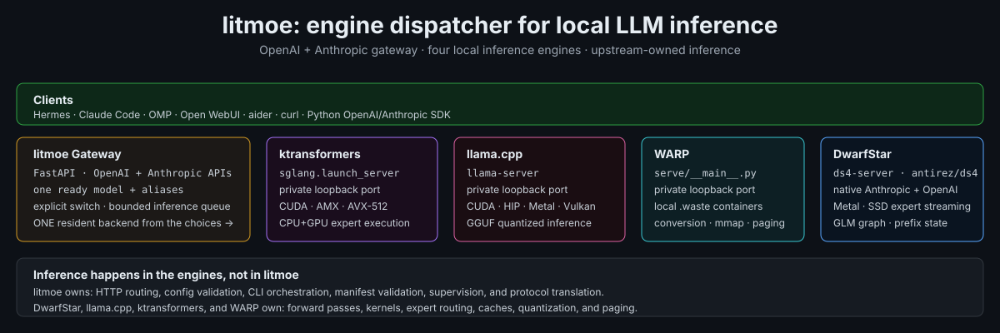

# litmoe

**lit + MoE** — a light gateway for Mixture-of-Experts models.

litmoe connects local model files, native inference engines, and coding agents
through one managed service. One `models.yaml`, one endpoint, **one resident
model at a time**—with explicit model switching and client configuration kept
separate from your normal setup.

The inference engines do the model computation. litmoe makes their setup,
lifecycle, and agent-facing access manageable together. Integrations use
[DwarfStar](https://github.com/antirez/ds4),
[llama.cpp](https://github.com/ggml-org/llama.cpp),
[ktransformers](https://github.com/kvcache-ai/ktransformers), and
[WARP](https://github.com/sqliteai/warp).

## What litmoe brings

- **One API for multiple engines.** Keep different engines in `models.yaml`; `litmoe switch MODEL` drains the current request, unloads the old engine, and loads the selected model. Discovery lists only the ready resident model and its aliases.
- **Claude Code, Hermes, and OMP.** OpenAI chat completions and Anthropic Messages provide local routing. DwarfStar handles Messages natively; other engines use the gateway's translator. Compatibility and measured latency are documented in [harness limitations](docs/HARNESSES.md). The local launchers leave normal client configuration unchanged.
- **A curated model catalog.** `litmoe models` shows resident-memory recommendations and separate storage-sized recipes. `litmoe install --model X` installs weights and writes their config entry. DwarfStar uses its pinned compatible GGUF; WARP recipes run upstream conversions into `.waste` containers.
- **Hardware-aware setup.** `litmoe doctor` reports physical cores, RAM, AVX-512/AMX, NVIDIA GPUs, and which engines are installed, then recommends an engine and models. llama.cpp context is fitted to the weights + KV budget (Metal's share of unified memory on macOS, RAM elsewhere). WARP fits its native context using its own resident-memory planner, not the container's disk size.
- **Engine lifecycle.** Subprocess supervision with health checks, clean shutdown via process groups, per-model append-only logs, and per-model CLI flag and environment passthrough. By default, `litmoe stop` targets only engines litmoe started (PID files); `--all` additionally matches engine processes by name.
- **Streaming and cancellation ownership.** Native SSE passes through without translating away thinking or typed tool references. DwarfStar leases remain occupied until native work is idle; failed acknowledgement stops the owned process before another request starts.

## How the pieces fit

```text
Claude Code / Hermes / OMP
          ↓
litmoe: configuration → admission and lifecycle → API routing
          ↓
one selected native inference engine → local model weights
```

| Responsibility | Owner |
| --- | --- |
| Model architecture, training, and released weights | The model's authors; quantized artifacts may have a separate publisher |
| GPU/CPU kernels, expert streaming, sampling, and model-state implementation | The selected upstream inference engine |
| Installation orchestration, model configuration, owned-process supervision, explicit switching, API adaptation, isolated harness launchers, and end-to-end measurements | litmoe |
| Agent planning, tool execution, and the user interaction loop | Claude Code, Hermes, OMP, or another connected client |

This separation is the project's purpose: changing an execution engine should
not require rebuilding the surrounding local-serving workflow. It is not a
claim that every backend supports the same protocols, cache behavior, or
latency. Those capabilities must be verified and documented per integration.

---

## Which models, on what hardware

The default recommendations favor small-active-parameter MoEs. Actual throughput depends on the engine, quantization, prompt, hardware, and memory pressure; retained CPU timing records are in [docs/measurements/](docs/measurements/README.md). The tiers below organize the catalog by approximate model size. `litmoe models` reports its RAM-fit estimate; startup also checks runtime memory requirements.

| Tier | Model (`--model`) | Total / active | Default quant | Disk | Notes |
|---|---|---|---|---|---|
| **48 GB laptop** | `gemma-4-26b-a4b` **(default)** | 26B / 4B | UD-Q4_K_XL | 17 GB | Multimodal (vision), 256K ctx |
| | `qwen3.6-35b-a3b` | 35B / 3B | UD-Q4_K_XL | 22 GB | 256K ctx |
| | `nemotron-3.5-lightning-30b-a3b` | 30B / 3B | UD-Q4_K_XL | 26 GB | Hybrid Mamba-MoE, 1M ctx |
| | `gpt-oss-20b` | 21B / 3.6B | UD-Q4_K_XL | 12 GB | Native MXFP4 |
| | `kimi-linear-48b` | 48B / 3B | Q4_K_M | 30 GB | KDA linear attention, 1M ctx |
| | `gemma-4-12b`, `qwen3.8-9b-distill` | dense 12B / 9B | Q4_K_M | 7 / 6 GB | Small dense |
| | `qwen3.8-27b`, `gemma-4-31b` | dense 27B / 31B | UD-Q4_K_XL | 18 / 19 GB | Dense alternatives |
| **96 GB laptop / desktop** | `gpt-oss-120b` | 117B / 5.1B | UD-Q4_K_XL | 63 GB | Native MXFP4 |
| | `qwen3.5-122b-a10b` | 122B / 10B | UD-IQ4_XS | 60 GB | |
| | `nemotron-3-super-120b-a12b` | 120B / 12B | UD-IQ4_XS | 64 GB | 1M ctx |
| | `llama-4-scout` | 109B / 17B | UD-Q4_K_XL | 62 GB | 10M ctx |
| **192 GB workstation** | `qwen3.8-flash-next` | 177B MoE | UD-Q4_K_XL | 111 GB | Requires llama.cpp support for `qwen4exp` |
| | `minimax-m2.7` | 229B / 10B | UD-Q4_K_XL | 141 GB | |
| | `deepseek-v4-flash` | 284B MoE | UD-Q4_K_XL | 155 GB | 1M ctx |
| **512 GB server** | `minimax-m3`, `glm-5.3`, `deepseek-v3.2`, `kimi-k2.5`, `kimi-k2.6` | 426B–1.03T | Q2–Q4 | 247–345 GB | |
| **768 GB server** | `qwen3.8` (2.4T/95B), `kimi-k3` (2.78T/93B) | | UD-IQ1_S | 508 / 594 GB | 93–95B active; no retained local timing logs |

ktransformers entries (Linux + NVIDIA GPU, native precision safetensors, no GGUF): `glm-5.3-flash` (FP8, 328 GB, 1M ctx, multimodal; this catalog entry uses ktransformers), `deepseek-v4-flash-kt` (MXFP4), `kimi-k2-thinking` (RAWINT4), `minimax-m3-kt` (MXFP8), `minimax-m2.7-kt` (FP8), `deepseek-v3.2-kt` (FP8). Support for a separately acquired GLM GGUF depends on the exact inference runtime and build; the catalog entry is not a claim that other engines cannot support the architecture.

WARP conversion entries: `glm-5.3-flash-warp` (306 GiB pinned source → 112 GB
container) and `deepseek-v4.1-flash-warp` (475 GiB pinned source → 299 GiB
container). They are storage recipes rather than RAM-tier defaults; see the
WARP section below for workspace requirements.

For GGUF entries, `litmoe install --model X` picks the quant for your machine: the default above when it fits, otherwise the largest one that does (e.g. `qwen3.5-122b-a10b` with 48 GB of RAM becomes UD-IQ2_XXS, 37 GB). `--quant` overrides. On Apple Silicon, Metal can use ~75% of RAM by default; `litmoe models` and `litmoe install` both apply that budget.

---

## Engines

For GLM-5.3-Flash on Apple Silicon, the replacement path is
[DwarfStar](#dwarfstar). WARP remains available for existing installations,
but its measured GLM full-harness failures are not treated as resolved.

### llama.cpp (default)

**Repo:** https://github.com/ggml-org/llama.cpp

- CUDA, HIP (AMD), Metal (Apple), Vulkan, SYCL, OpenCL, CANN — and plain CPU
- 1–8-bit GGUF quantization; pre-quantized GGUFs from [Unsloth](https://huggingface.co/unsloth)
- Catalog entries identify the required model architecture; the installed llama.cpp build must support it.
- The adapter enables `--jinja` for chat-template processing.

**Install:** `litmoe install --engine llamacpp` — downloads the matching release binary (`--llamacpp-variant cpu|cuda|cuda13|vulkan|rocm`, auto-selects CUDA when an NVIDIA GPU is visible) or builds from source when glibc < 2.34.

### ktransformers

**Repo:** https://github.com/kvcache-ai/ktransformers

litmoe uses **SGLang + kt-kernel** (`python -m sglang.launch_server --kt-method …`): GPU attention with CPU expert offload.

- **Requirements:** Linux x86-64 and an NVIDIA GPU compatible with the selected model/backend. The installer uses PyPI wheels on Python 3.11/3.12 with glibc ≥ 2.35; otherwise it attempts the upstream source build, which requires a compatible build toolchain.
- **CPU expert backends (`kt_method`):** FP8, FP8_PERCHANNEL, BF16, RAWINT4, MXFP4, MXFP8 need **AVX-512**; AMXINT4/AMXINT8 need Intel AMX; LLAMAFILE (GGUF weights) runs on AVX2.
- **Models:** see the ktransformers catalog entries above. Fine-tuning and NPU serving are outside litmoe's scope.

### WARP

**Repo:** https://github.com/sqliteai/warp

WARP serves local `.waste` containers by memory-mapping expert weights and
paging them from local storage. litmoe starts WARP's upstream OpenAI-compatible
server as a loopback subprocess; litmoe remains the gateway/supervisor and WARP
remains the inference runtime. No remote inference API is involved.

**Catalog model install:** litmoe can build either supported WARP container from
pinned source weights:

```bash
litmoe install --model glm-5.3-flash-warp
litmoe install --model deepseek-v4.1-flash-warp

# Keep the large source staging area separate from output on internal NVMe.
litmoe install --model glm-5.3-flash-warp \
  --staging-dir /mnt/bulk/warp-staging \
  --models-dir /mnt/nvme/litmoe-models

# Optional conversion concurrency and irreversible source-shard reclamation.
litmoe install --model deepseek-v4.1-flash-warp \
  --warp-jobs 6 --reclaim-source
```
The command requires `git`, `make`, `bash`, `curl`, and `uv`. litmoe checks
dependencies and free disk space, prints the pinned revision, sizes, and
paths, and asks for confirmation before writing. It then installs WARP
runtime commit `09fcff352ca55223b08ee222d15054b90546c6a9` with litmoe's
bundled exact-arithmetic prefill optimization, downloads the pinned source
weights, converts them, validates the resulting WARP v0
manifest and artifacts, and registers the absolute container path with
`engine: warp`, `n_ctx: 0`, and `warp_auto_context: true`. A positive `--n-ctx`
selects a fixed window instead. When `HF_TOKEN` is set, litmoe uses a
private temporary curl config; the token is never printed or passed in a
child process's arguments or environment.

Interrupting the command (Ctrl-C or a closed terminal) stops the download
and conversion cleanly; rerun the same command to resume — nothing already
downloaded is refetched. A second install of the same model is refused
while one is running. During the download and conversion, litmoe prints a
heartbeat every minute with elapsed time and the newest progress line;
the full logs are at the staging `download.log` and the run-report
`pipeline.log`.

| Catalog id | Pinned source revision | Source | Conversion workspace | Output |
|---|---|---:|---:|---:|
| `glm-5.3-flash-warp` | `eb9eb208eb0d988989d07a6a12d0fdeb5f52574a` | 306 GiB | 120 GiB | 112 GB |
| `deepseek-v4.1-flash-warp` | `dba1be0a40aa45a94ad051997016db3960a90277` | 475 GiB | 310 GiB | 299 GiB |

By default, output is `<models-dir>/<model-id>.waste` and source staging is
`<models-dir>/.staging/<model-id>`. Put `--models-dir` on fast internal NVMe;
`--staging-dir` may point to another filesystem. On failure, partial data
and reports remain in place; rerun the same command to resume.
`--reclaim-source` deletes completed source shards as the conversion
progresses, saving peak storage at the cost of re-downloading them on a retry.

Watch live progress in the stage logs while the CLI heartbeats:

```bash
tail -f <models-dir>/.staging/<model-id>/download.log
tail -f <models-dir>/<model-id>.warp-run/pipeline.log
```

After installation, serve the installed entry directly:

```bash
litmoe serve glm-5.3-flash-warp
# or: litmoe serve deepseek-v4.1-flash-warp
```

**Runtime-only/manual alternative:** `litmoe install --engine warp` installs
only the same pinned, patched runtime. Re-run it to upgrade an older unpatched
installation without reconverting weights. Add an existing local `.waste`
container to `models.yaml` yourself; manually created or acquired containers
remain supported. See [native optimization measurements](docs/ARCHITECTURE.md#native-prefill-optimization)
for correctness checks and the limits of the measured speedup.

The [pinned upstream WARP documentation](https://github.com/sqliteai/warp/blob/09fcff352ca55223b08ee222d15054b90546c6a9/README.md) reports the following measurements. They are not litmoe benchmarks or performance guarantees:

| Container | Upstream container size | Upstream resident floor | Upstream throughput |
|---|---:|---:|---:|
| GLM-5.3-Flash | 112 GB | 5.14 GB | 3.32 tok/s (short) and 3.86 tok/s (long) on WARP's 64 GB M5 Pro |
| DeepSeek-V4.1-Flash | 299 GiB | 4.86 GB | about 3.7 tok/s |

Those published throughput figures assume fast internal NVMe and do not
establish full-harness performance. The 96 GiB M2 Max investigation found serial
GLM prefill, reset-per-request state, and a fresh Claude request containing
84,442 native tokens. See the [replacement investigation](docs/plans/2026-09-30-inference-redesign.md)
for the measured workload and acceptance gates.
The upstream resident floor is not total serving memory: context, caches, and
optional vision add memory.

### DwarfStar

**Upstream:** [antirez/ds4](https://github.com/antirez/ds4), by Salvatore
Sanfilippo and contributors. litmoe adds installation, protocol integration,
and lifecycle management; the Metal graph, expert streaming, and model-state
implementation are DwarfStar's work.

```bash
# Apple Silicon macOS with Xcode Command Line Tools, git, and make.
litmoe install --model glm-5.3-flash-dwarfstar
litmoe serve glm-5.3-flash-dwarfstar
./scripts/claude-local --model glm-5.3-flash-dwarfstar
./scripts/omp-local --model glm-5.3-flash-dwarfstar
```

- Installs source revision `0aaea5a238fb41a35106a551e73c8409dfb751ac`
  with `litmoe/patches/dwarfstar-serving.patch`. Runtime-only installation:
  `litmoe install --engine dwarfstar`.
- Downloads `GLM-5.3-Flash-Q4_K.gguf` from `antirez/glm-5.3-flash-gguf`,
  pinned at `b2fa29d7a6b410db11221c904973967b80b760f5`: about 191 GB
  on disk. SSD expert streaming is explicit; disk size is not a resident-RAM
  requirement. There is no automatic lower-precision substitution.
- Native Anthropic Messages and exact rendered token counts bypass the
  OpenAI translator. The native patch resolves typed discovery references.
  Claude's launcher enables tool search only after the ready runtime advertises it.
- The configured context is passed unchanged and checked at readiness.
  Native allocation failure is an error, not a hidden context reduction.
- Prefix state belongs to DwarfStar. Disk state is separated by model-file
  identity, upstream revision, and patch, with strict quantization matching.
- On disconnect or stream EOF, admission waits up to 10 seconds for native
  quiescence. An unconfirmed acknowledgement stops the owned engine; the next
  request reloads it. Native cancellation checks are chunked, not instantaneous.

**Verification boundary:** the adapter and installer are implemented; real
GLM inference and actual Claude/OMP performance are still being verified.
No model-latency claim follows from compilation or protocol tests. See the
[measurement record](docs/measurements/README.md) and
[setup details](docs/SETUP.md#dwarfstar-glm-53-flash).
Forced Anthropic tool choice (`any` or a named tool) is rejected explicitly;
`auto` and `none` are supported. This recipe does not install the vision encoder.

---

## Quick start

```bash
git clone https://github.com/chazhyseni/litMoE
cd litMoE
pip install -e .            # use the SAME Python for install and serve

litmoe doctor               # hardware, engines, recommended models for your RAM
litmoe install              # installs llama.cpp and lists models that fit
litmoe install --model gemma-4-26b-a4b   # 17 GB; writes the entry into models.yaml
litmoe serve

curl http://127.0.0.1:8090/v1/models
```

To install a catalog WARP model, run `litmoe install --model
glm-5.3-flash-warp` or `litmoe install --model
deepseek-v4.1-flash-warp`, then `litmoe serve <id>`. To serve a container you
already have, install only the runtime with `litmoe install --engine warp`,
add the local `.waste` path to `models.yaml`, and run `litmoe serve`.

Or skip the pre-download: `litmoe init` writes a `models.yaml` whose `model_path` entries are HuggingFace specs (`owner/repo:QUANT`); llama-server fetches them on first start.

> **Multiple Python installations:** install and run litmoe from the same environment. For example, run `/path/to/python -m pip install -e .`, then use that environment's `litmoe` executable. `litmoe doctor` prints the interpreter in use; it does not check model-file permissions.

Full guide: [docs/SETUP.md](docs/SETUP.md)

---

## models.yaml

Set `host: 127.0.0.1` explicitly for local use. Generated configurations use
loopback, but a hand-written configuration that omits `host` defaults to
`0.0.0.0` (all interfaces) and omitting `api_key` disables authentication.

```yaml
host: 127.0.0.1
port: 8090
api_key: null            # or a string to require Bearer / x-api-key auth

models:
  # Default MoE with vision. HF spec -> llama-server downloads on first start.
  - id: gemma-4-26b-a4b
    engine: llamacpp
    model_path: unsloth/gemma-4-26B-A4B-it-GGUF:UD-Q4_K_XL
    n_gpu_layers: -1       # -1 = offload what fits (Metal/CUDA), 0 = CPU only
    n_ctx: 0               # 0 (or anything < 16384) = native context, reduced only if the KV cache won't fit RAM
    aliases:               # Anthropic model names Claude Code sends; haiku is used for its background calls
      - claude-sonnet-4-5
      - claude-opus-4-1
      - claude-haiku-4-5

  # Pre-downloaded GGUF (what `litmoe install --model` writes)
  - id: qwen3.6-35b-a3b
    engine: llamacpp
    model_path: /home/me/.litmoe/models/qwen3.6-35b-a3b/UD-Q4_K_XL/Qwen3.6-35B-A3B-UD-Q4_K_XL.gguf
    n_ctx: 262144
    extra_args: ["-t", "12"]   # -t overrides the physical-core default; context/slots are gateway-owned

  # ktransformers via sglang-kt (Linux + NVIDIA GPU)
  - id: glm-5.3-flash
    engine: ktransformers
    model_path: zai-org/GLM-5.3-Flash      # HF id or local safetensors directory
    kt_method: FP8                         # CPU expert backend; LLAMAFILE + gguf_path for GGUF experts
    kt_num_gpu_experts: 0                  # experts kept on GPU (0 = all on CPU)
    n_ctx: 262144
    extra_args: ["--tool-call-parser", "glm47", "--reasoning-parser", "glm45"]

  # Manual WARP path. Catalog installs write an absolute generated .waste path instead.
  - id: glm-5.3-flash-warp
    engine: warp
    model_path: ~/models/glm53.waste
    n_ctx: 0
    warp_auto_context: true              # fit native context at each startup

  - id: deepseek-v4.1-flash-warp
    engine: warp
    model_path: ~/models/deepseek-v4.1-flash.waste
    n_ctx: 0
    warp_auto_context: true

  # DwarfStar GLM Metal/SSD streaming (Apple Silicon macOS)
  - id: glm-5.3-flash-dwarfstar
    engine: dwarfstar
    model_path: ~/.litmoe/models/glm-5.3-flash-dwarfstar/GLM-5.3-Flash-Q4_K.gguf
    n_ctx: 1048576
    dwarfstar_ssd_streaming: true
```

Per-model fields: `id`, `engine` (`llamacpp` | `ktransformers` | `warp` | `dwarfstar`), `model_path`, `n_ctx`, `aliases`, `extra_args`, and `env`; llama.cpp also uses `n_gpu_layers`, while ktransformers uses `gguf_path`, `kt_method`, `kt_num_gpu_experts`, `kt_cpuinfer` (default: physical cores), and `kt_threadpool_count` (default: NUMA nodes). DwarfStar uses `dwarfstar_ssd_streaming`, optional `dwarfstar_cache_experts`, and optional `dwarfstar_kv_dir`; its configured context is passed unchanged.

For WARP, `model_path` must be a local `.waste` container. With `warp_auto_context: true`, each startup fits the native window (1,048,576 tokens for both catalog WARP models) using the installed WARP runtime's `plan_memory`. Its recommended resident memory, including vision when enabled, must fit 75% of `usable_ram()` or a smaller explicit `--budget`. If native does not fit, context rounds down in 4096-token blocks. A planner failure stops that model; there is no silent fixed-window fallback.

The adapter always passes a positive `--ctx` and persists the selected `n_ctx` **with automatic mode still enabled**. Unmarked legacy `n_ctx: 0` and `65536` entries migrate to automatic sizing. An old intentional 65536 is indistinguishable from the shipped default: set `warp_auto_context: false` alongside a positive `n_ctx` to keep any fixed window. Other unmarked positive limits remain fixed. Changing context requires a gateway restart, not a download or conversion.

WARP `extra_args` supports `--budget`, `--threads`, `--cpus`, `--cache`, `--vision`, and `--verify`; conflicting `--ctx` flags are rejected. The planning ceiling measures RAM **capacity**, not currently free RAM. litmoe owns one resident model; leave room for other applications and independently launched inference servers. An oversized explicit `--budget` still passes upstream unchanged. Unknown manual model IDs need `config.max_position_embeddings` in the container manifest or an explicit fixed context.

A fixed WARP budget is opt-in, for example `extra_args: ["--budget", "64G"]`;
choose it for the host's capacity and other workloads. Catalog installation
does not impose 64G. The pinned GLM chat format always opens a reasoning
channel; `--no-thinking` does not disable it. Initial WARP warmup takes the
same inference lock as serving, so it cannot overlap an admitted request;
it does not guarantee that a later prompt's experts are cached.

llama-server gets one slot and `-t <physical cores>` unless `extra_args` sets `-t`. Configure context through `n_ctx`, not `-c`/`--ctx-size`; slot/context overrides in `extra_args` are rejected. Context corrections are written back into `models.yaml` (comments are not preserved by that rewrite). Requests are serialized with up to `max_queue_size: 8` waiting admissions and `queue_timeout: 600` seconds; overflow/expiry returns HTTP 429. The queue accommodates slow reasoning turns, not parallel generation.

---

## Commands

```bash
litmoe doctor          # CPU/GPU/RAM, engines, recommended models
litmoe models          # catalog by RAM tier with fits / does-not-fit for this machine
litmoe init            # write models.yaml with fast defaults for this RAM
litmoe install         # install engines and/or download a model (--model, --quant, --engine)
litmoe serve           # gateway + first configured model; Ctrl-C stops the owned engine
litmoe serve X         # select one initial model; --force skips its RAM-fit refusal
litmoe switch Y        # drain, stop X, load configured Y; no automatic substitution
litmoe status          # selected/active model, queue, context, capabilities, failures
litmoe bench --json    # paired direct-engine/gateway streaming measurements; run on gateway host
litmoe stop            # stop the engines litmoe started (PID files); --all also matches by name
```

---

## Architecture



```
   Clients (Claude Code, Hermes, OMP, Open WebUI, aider, curl)
        │  HTTP  /v1/chat/completions · /v1/messages · /v1/models
        ▼
   litmoe gateway (server.py + runtime.py)
        │  resolve active model/alias → bounded single-request admission
        │  Anthropic /v1/messages ⇄ OpenAI chat completions
        ▼
   ONE resident subprocess: llama-server OR sglang-kt OR WARP serve
        └─ explicit switch: drain → stop old → start new → ready
```

The resident engine gets a free loopback port starting at 8081, skipping the gateway port and existing listeners. litmoe never touches the forward pass, silently switches models, truncates prompts, or falls back to cloud inference.

Details: [docs/ARCHITECTURE.md](docs/ARCHITECTURE.md) · [docs/architecture.svg](docs/architecture.svg) · design rationale and measurements: [docs/METHODOLOGY.md](docs/METHODOLOGY.md)

---

## Connect your tools

Design rule: **using a local model must never change what a harness does when you run it normally.** litmoe never writes to `~/.claude`, `~/.hermes/config.yaml`, or your shell rc; everything below is per-process or per-profile. Details and a verification checklist: [docs/HARNESSES.md](docs/HARNESSES.md).

### Claude Code
```bash
./scripts/claude-local                              # Claude Code → local model, isolated
./scripts/claude-local --model qwen3.6-35b-a3b -p "explain this repo"
claude                                              # normal Claude Code, still your Anthropic account
```
`claude-local` sets `ANTHROPIC_BASE_URL`, `ANTHROPIC_AUTH_TOKEN` (the gateway key, or a dummy when authentication is disabled), the model-alias variables, and a separate `CLAUDE_CONFIG_DIR` **only for that one process**, then execs `claude`. Do not `export ANTHROPIC_BASE_URL` in your shell; clients that read it will use that endpoint.

### Hermes Agent
```bash
./scripts/hermes-local                              # one session against the gateway
./scripts/hermes-local -q "one question"
hermes                                              # unchanged
```
For a persistent setup, create a separate profile (`hermes profile create litmoe --clone`, then `hermes -p litmoe model` → Custom endpoint `http://127.0.0.1:8090/v1`), or add a `model_aliases:` entry with its own `api_key` and switch with `/model local` — see [docs/HARNESSES.md](docs/HARNESSES.md) for the exact block. Avoid `hermes config set model.*` — it rewrites the default profile.

### OMP (oh-my-pi)
```bash
./scripts/omp-local                                 # isolated local profile and model roles
./scripts/omp-local --model qwen3.6-35b-a3b -p "explain this repo"
omp                                                 # normal OMP configuration, unchanged
```
The requested model must already be active. The launcher discovers its effective context, pins model roles locally, and disables model fallback. See [HARNESSES](docs/HARNESSES.md) for cache and cancellation limits.

### Open WebUI
Add `http://127.0.0.1:8090/v1` as an **additional** OpenAI API connection (keep the existing ones).

### curl
```bash
curl http://127.0.0.1:8090/v1/chat/completions -H "Content-Type: application/json" -d '{
  "model": "gemma-4-26b-a4b",
  "messages": [{"role": "user", "content": "hello"}]
}'

curl http://127.0.0.1:8090/v1/messages -H "Content-Type: application/json" -d '{
  "model": "gemma-4-26b-a4b",
  "max_tokens": 1024,
  "messages": [{"role": "user", "content": "hello"}]
}'
```

---

## Docker

```bash
cd deploy
cp models.yaml.example models.yaml   # edit paths first
docker compose up
```

Services: **litmoe-gateway** on port **8000** (`http://127.0.0.1:8000/v1`, loopback only — no auth by default) and **openwebui** on port **8080**. Model files are mounted read-only from `$LITMOE_MODELS_DIR` (default `~/.litmoe/models`). `deploy/caddy/Caddyfile` is an optional reverse-proxy front; it is not started by the compose file.

The Compose example publishes Open WebUI on **all host interfaces** at port
8080 with `WEBUI_AUTH=false`. Restrict its port binding and enable WebUI
authentication before exposing it beyond a trusted local environment.

---

## What litmoe does NOT do

- No independent inference engine or bundled model weights. Native runtimes own the forward pass, kernels, and quantization. litmoe carries documented WARP optimization and DwarfStar serving-contract patches; these do not make upstream inference engines litmoe implementations. No automatic remote inference fallback is enabled.
- No multi-node distribution. Single node.
- No litmoe model-conversion implementation. Catalog WARP installs orchestrate pinned upstream WARP tooling and validate its WARP v0 output; other conversions use `llama-quantize`, Unsloth, or the relevant upstream tooling.
- No fine-tuning. For LoRA on MoE experts see the ktransformers × LlamaFactory cookbook upstream.

---

## Upstream acknowledgements

litmoe depends on the work of the projects it orchestrates:

- **[DwarfStar (`antirez/ds4`)](https://github.com/antirez/ds4)**, by Salvatore
  Sanfilippo (antirez) and the ds4.c contributors, provides the native engine
  used by the GLM Metal/SSD-streaming integration. Its GPU execution,
  expert streaming, model-state machinery, and native server are upstream
  work—not litmoe inventions. DwarfStar also acknowledges its foundations in
  llama.cpp and GGML; its MIT license retains ds4.c, ggml, and DeepSeek notices.
- **[llama.cpp and GGML](https://github.com/ggml-org/llama.cpp)** provide the
  GGUF execution runtime, quantization ecosystem, and hardware kernels used by
  litmoe's llama.cpp integration.
- **[KTransformers](https://github.com/kvcache-ai/ktransformers)** and
  **[SGLang](https://github.com/sgl-project/sglang)** provide the heterogeneous
  CPU/GPU execution and serving stack used by the ktransformers adapter.
- **[WARP](https://github.com/sqliteai/warp)** provides `.waste` conversion,
  expert paging, and inference; litmoe orchestrates its pinned tooling and
  documents its own small patch separately.
- **Model authors, [Hugging Face](https://huggingface.co/), and quantization
  publishers such as [Unsloth](https://huggingface.co/unsloth)** provide the
  weights, distribution infrastructure, and artifacts referenced by the catalog.

These are dependencies and independently developed projects, not claims of
affiliation or endorsement. Upstream software and model artifacts retain their
own licenses. DwarfStar is an implemented integration; implementation checks
and pending real-model verification are distinguished above.

## License

litmoe's own code is licensed under [Apache 2.0](LICENSE). That license does
not relicense upstream engines, their incorporated third-party code, or model
weights. Preserve the applicable upstream copyright and license notices when
redistributing them; see [third-party acknowledgements](THIRD_PARTY_NOTICES.md).
